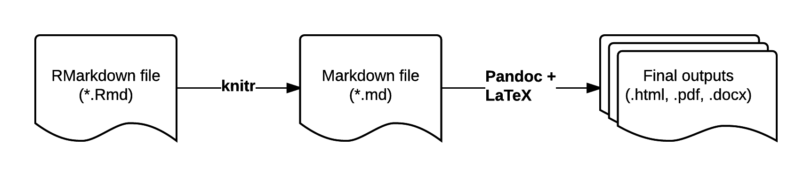

# Markdown Reference

## Emphasis

```
Italics with _underscores_.

Bold with **double asterisks**.

Combined emphasis with **asterisks and _underscores_**.
```

Italics with _underscores_.

Bold with **double asterisks**.

Combined emphasis with **asterisks and _underscores_**.


## Section headings

```
# Header 1

A single # results in a top-level major heading.

## Header 2

Two ##s results in a sub-heading.

### Header 3

Three ###s results in a sub-sub-heading.

#### Header 4

And so on...
```

> # Header 1
> 
> A single # results in a top-level major heading.
> 
> ### **Header 2**
> 
> Two ##s results in a sub-heading.
> 
> ### Header 3
> 
> Three ###s results in a sub-sub-heading.
> 
> #### Header 4
> 
> And so on...

## Lists

### Unordered lists (i.e., bullets)

```
- Unordered list item
- Unordered list item
    - Unordered list sub-item
    - Unordered list sub-item
- Unordered list item
```

- Unordered list item
- Unordered list item
    - Unordered list sub-item
    - Unordered list sub-item
- Unordered list item

### Ordered lists (i.e., numbers)

```
1. Ordered list item
2. Ordered list item
    1. Ordered list sub-item
    2. Ordered list sub-item
3. Ordered list item
```

1. Ordered list item
2. Ordered list item
    1. Ordered list sub-item
    2. Ordered list sub-item
3. Ordered list item

### Mixed lists

```
1. First ordered list item in a mixed list
2. Another item
    - Unordered sub-list. 
1. Actual numbers don't matter, just that it's a number
    1. Ordered sub-list
    1. Ordered sub-list
4. And another item.
```

1. First ordered list item in a mixed list
2. Another item
    - Unordered sub-list. 
1. Actual numbers don't matter, just that it's a number
    1. Ordered sub-list
    1. Ordered sub-list
4. And another item.


## Links

There are two ways to create links.

```
I'm an inline link to [Google's homepage](https://www.google.com).
```

I'm an inline link to [Google's homepage](https://www.google.com).

```
Bare URLs in angle brackets get turned into links <https://www.google.com>.
```

Bare URLs in angle brackets get turned into links <https://www.google.com>.

## Images

```

```


## Code and Syntax Highlighting

### Inline code

```
Inline `code` has `back-ticks around` it.
```

Inline `code` has `back-ticks around` it.

### Code blocks

    ```
    Blocks of code are "fenced" by lines containing three backticks.
    If you don't specify, there will be no syntax highlighting applied.
    ```

```
Blocks of code are "fenced" by lines containing three backticks.
If you don't specify, there will be no syntax highlighting applied.
```

### Code blocks with syntax highlighting

#### E.g., R code 

    ```r
    # Just specify the language after the opening fence.
    library(dplyr)
    gm <- read.csv("gapminder.csv")
    matrix(rnorm(25), nrow=5)[1:2,3:4]
    ```

```r
# Just specify the language after the opening fence.
library(dplyr)
gm <- read.csv("gapminder.csv")
matrix(rnorm(25), nrow=5)[1:2,3:4]
```

#### E.g., Python code

    ```python
    # This is a python comment
    s = "Python syntax highlighting"
    print s
    ```

```python
# This is a python comment
s = "Python syntax highlighting"
print s
```

## Tables

Tables aren't part of the Markdown core, but they are supported by some renderers.

```
Colons can be used to align columns.

| Tables        | Are           | Cool  |
| ------------- |:-------------:| -----:|
| col 3 is      | right-aligned | $1600 |
| col 2 is      | centered      |   $12 |
| zebra stripes | are neat      |    $1 |

There must be at least 3 dashes separating each header cell.
The outer pipes (|) are optional, and you don't need to make the 
raw Markdown line up prettily. You can also use inline Markdown.

Markdown | Less | Pretty
--- | --- | ---
*Still* | `renders` | **nicely**
1 | 2 | 3
```

Colons can be used to align columns.

| Tables        | Are           | Cool |
| ------------- |:-------------:| -----:|
| col 3 is      | right-aligned | $1600 |
| col 2 is      | centered      |   $12 |
| zebra stripes | are neat      |    $1 |

There must be at least 3 dashes separating each header cell. The outer pipes (|) are optional, and you don't need to make the raw Markdown line up prettily. You can also use inline Markdown.

Markdown | Less | Pretty
--- | --- | ---
*Still* | `renders` | **nicely**
1 | 2 | 3


## Blockquotes

``` 

> It was the best of times, it was the worst of times, it was the age of
wisdom, it was the age of foolishness, it was the epoch of belief, it was the
epoch of incredulity, it was the season of Light, it was the season of Darkness,
it was the spring of hope, it was the winter of despair, we had everything
before us, we had nothing before us, we were all going direct to Heaven, we were
all going direct the other way – in short, the period was so far like the
present period, that some of its noisiest authorities insisted on its being
received, for good or for evil, in the superlative degree of comparison only.

Quote break.

> Oh yeah, you can _put_ **Markdown** into a blockquote. 
```

> It was the best of times, it was the worst of times, it was the age of wisdom, it was the age of foolishness, it was the epoch of belief, it was the epoch of incredulity, it was the season of Light, it was the season of Darkness, it was the spring of hope, it was the winter of despair, we had everything before us, we had nothing before us, we were all going direct to Heaven, we were all going direct the other way – in short, the period was so far like the present period, that some of its noisiest authorities insisted on its being received, for good or for evil, in the superlative degree of comparison only.

Quote break.

> Oh yeah, you can _put_ **Markdown** into a blockquote. 


## Horizontal Rule

```
Three or more hyphens, asterisks, or underscores...

---

Gives you a horizontal rule
```

Three or more hyphens, asterisks, or underscores...

----

Gives you a horizontal rule.

## Further resources

- John Gruber's original specification: <http://daringfireball.net/projects/markdown/syntax>
- GitHub Flavored Markdown (GFM): <https://help.github.com/articles/github-flavored-markdown/>
- A more extensive cheat sheet: <https://github.com/adam-p/markdown-here/wiki/Markdown-Cheatsheet>
- Desktop-based Markdown editors with live previews
    - Windows: Markdownpad (<http://markdownpad.com/>)
    - Mac: MacDown (<http://macdown.uranusjr.com/>)
- Web-based Markdown authoring tools:
    - Dillinger (<http://dillinger.io/>): connects to Dropbox, Github, Google Docs, and OneDrive.
    - StackEdit (<https://stackedit.io/>): connects to Dropbox, Google Drive, and can push documents directly to a blog hosted on Blogger, Tumblr, Wordpress, etc.
    - Authorea (<https://www.authorea.com/>): version-controlled collaborative editor designed for researchers.
    - Penflip (<https://www.penflip.com/>): a distraction-free in-browser collaborative writing app. Compiles to PDF, HTML, e-book formats, backed by git.